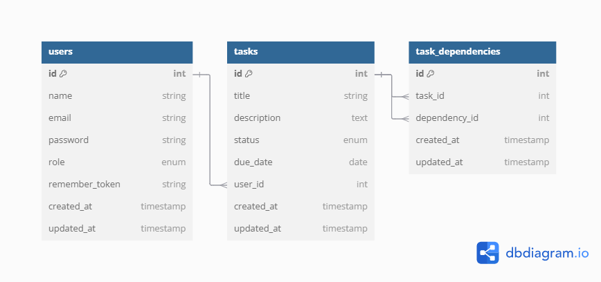

# Task Management

This application is a task management API built using Laravel.

## Prerequisites

- PHP 8.0 or higher
- Composer
- MySQL
- Laravel CLI

## Setup Steps

1. Clone the repository:
   \`\`\`
   git clone https://github.com/Mahmuod-Eldeep/Task-Management
   cd Task-Management
   \`\`\`

2. Install dependencies:
   \`\`\`
   composer install
   \`\`\`

3. Create environment file:
   \`\`\`
   cp .env.example .env
   \`\`\`

4. Modify the \`.env\` file and add your database details:
```text
   DB_CONNECTION=mysql
   DB_HOST=127.0.0.1
   DB_PORT=3306
   DB_DATABASE=your_database_name
   DB_USERNAME=your_database_username
   DB_PASSWORD=your_database_password
  ```

5. Generate application key:
   \`\`\`
   php artisan key:generate
   \`\`\`

6. Run migrations and seed initial data:
   \`\`\`
   php artisan migrate --seed
   \`\`\`

## Running the Application

To run the application locally, use the following command:

\`\`\`
php artisan serve
\`\`\`

The application will be available at \`http://localhost:8000\`.

Make sure to include the authentication token in the request header to access protected endpoints.

## Database ERD

Below is the Entity-Relationship Diagram for the Task Management API database:

```text
erDiagram
    USERS ||--o{ TASKS : creates
    USERS {
        id int PK
        name string
        email string
        password string
        role enum
        remember_token string
        created_at timestamp
        updated_at timestamp
    }
    TASKS ||--o{ TASK_DEPENDENCIES : has
    TASKS {
        id int PK
        title string
        description text
        status enum
        due_date date
        user_id int FK
        created_at timestamp
        updated_at timestamp
    }
    TASK_DEPENDENCIES {
        id int PK
        task_id int FK
        dependency_id int FK
        created_at timestamp
        updated_at timestamp
    }
```


## Contributing

If you'd like to contribute to this project, please create a new branch and submit a pull request with your proposed changes.


